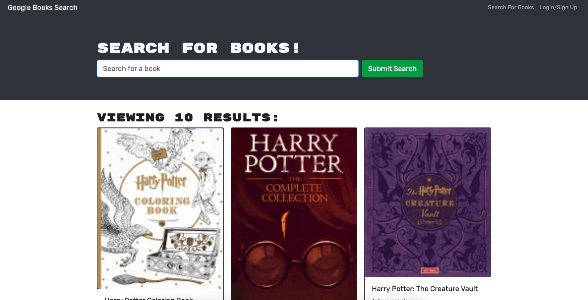

# Book-Search-Engine

## Description

This application allows a user to to search new books using Goggle Books API and save a list of boks they would like to purchase. The use is able to view list of books but must login/signup to save books.

### Live Link

https://intense-gorge-68070.herokuapp.com/

## Table of Contents

- [Getting Started](#getting-started)
- [Visual Example](#visual-example)
- [Tech Used](#tech-used)
- [Licenese](#license)

## Getting Started

### Prerequisites

- npm
  ```sh
  npm install npm@latest -g
  ```

### Installation

1. Clone the repo
   ```sh
   git clone https://github.com/ZestyLimones/Book-Search-Engine.git
   ```
2. Install NPM packages
   ```sh
   npm install
   ```
   <p align="right">(<a href="#top">back to top</a>)</p>

## Visual Exampes



  <p align="right">(<a href="#top">back to top</a>)</p>

## Tech Used

  <div style='margin: 1em 0;'>


</div>

<p align="right">(<a href="#top">back to top</a>)</p>

## License

MIT

<p align="right">(<a href="#top">back to top</a>)</p>
